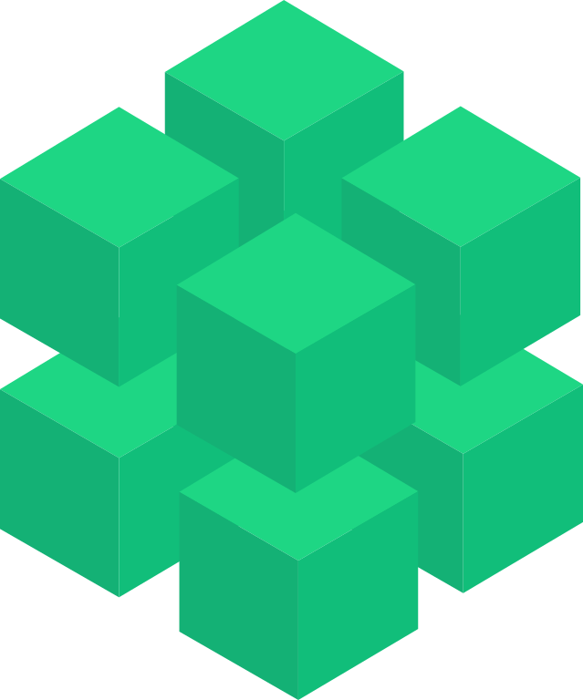

Welcome to VoxelMap’s Documentation!
====================================

Make 3D models with **NumPy + Python** 🚀

   `View VoxelMap on GitHub <https://github.com/andrewrgarcia/voxelmap>`_

---

What is VoxelMap?
-----------------

VoxelMap is a **lightweight Python library** for turning NumPy arrays into:

- **Voxel models** → colored cubes for quick prototyping.  
- **Meshes** → low-poly `.obj` files with ImageMesh & MarchingMesh.  
- **Interactive 3D** → zoom, pan, and rotate with PyVista.  

It’s designed for **simplicity first**, with optional extras when you need more.

---

Quickstart
----------

A red cube in 3 lines:

.. code-block:: python

   import numpy as np
   from voxelmap import Model

   arr = np.ones((3, 3, 3))
   model = Model(arr)
   model.set_color(1, "red")
   model.draw_mpl("custom")

➡ Produces a solid red cube.

For more, see :doc:`usage`.

---

Contents
--------

.. toctree::
   :maxdepth: 2

   installation
   usage
   api
   io 
   mesh

Examples
--------

.. toctree::
   :maxdepth: 1

   examples/skull
   examples/meshrec

Advanced
--------

.. toctree::
   :maxdepth: 1

   imagemesh

---

Notes
-----

- VoxelMap v5.0.0 introduces a **simplified API**:  
  use ``palette`` and ``set_color`` instead of ``hashblocks``.  
- Interactive features require optional installs (see :ref:`installation`).  
- This project is under active development. Contributions welcome!

